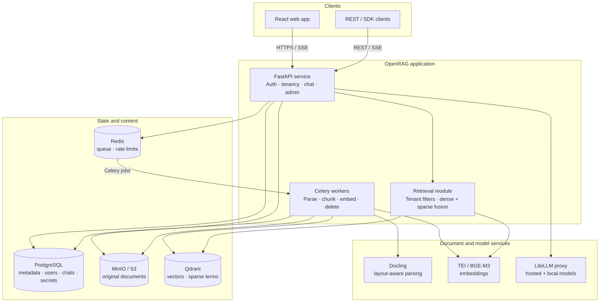

# OpenRAG architecture

OpenRAG is a modular monolith deployed as separate API and worker processes. Business rules live in domain modules shared by both processes; PostgreSQL, Redis, MinIO, Qdrant, LiteLLM, and the embedding service remain replaceable infrastructure boundaries.

## Ingestion flow

1. The API authorizes the user and workspace, stores the original file in MinIO, creates document metadata in PostgreSQL, and enqueues a Celery chain.
2. A worker parses supported documents with Docling, preserving page and table context.
3. The worker creates searchable chunks, generates dense and sparse representations, and upserts them to Qdrant with organization and workspace identifiers.
4. Document status moves through queued, processing, indexed, or failed; the frontend polls active documents and displays the transition without a reload.
5. Deletion is asynchronous and propagates to PostgreSQL metadata, object storage, and Qdrant.

## Query flow

1. The API authenticates the user and resolves their organization and selected workspace.
2. The retrieval module constructs the single tenant-aware Qdrant filter path, performs dense and sparse search, and fuses ranked results.
3. Relevant chunks are sent through LiteLLM to the selected hosted or local completion model.
4. The API streams retrieval events, answer deltas, citations, usage, and completion status over SSE.
5. The frontend renders sanitized Markdown, citation chips, source metadata, and branch-aware message controls.

## Security boundaries

- Organization and workspace identifiers are enforced inside storage and retrieval queries, not filtered after results return.
- Provider keys are write-only API inputs, envelope-encrypted in PostgreSQL, and exposed later only as fingerprints.
- Access tokens stay in frontend memory; refresh tokens use HTTP-only cookies.
- Document text and model output are treated as untrusted content.
- API authorization uses declared role dependencies, and superadmin-only model operations are independently protected from the UI.

## Current deployment shape

The development stack exposes the React app and FastAPI service directly. A production deployment should put them behind TLS ingress/load balancing and add OpenTelemetry, Prometheus, and Grafana. OCR, external connectors, Kubernetes/Helm packaging, public CLI/SDK packages, and high-availability topology are roadmap items rather than hidden assumptions in the current stack.
